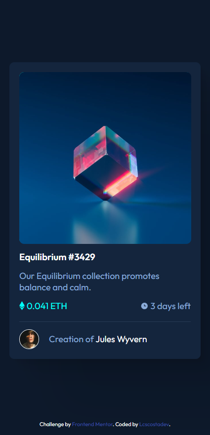
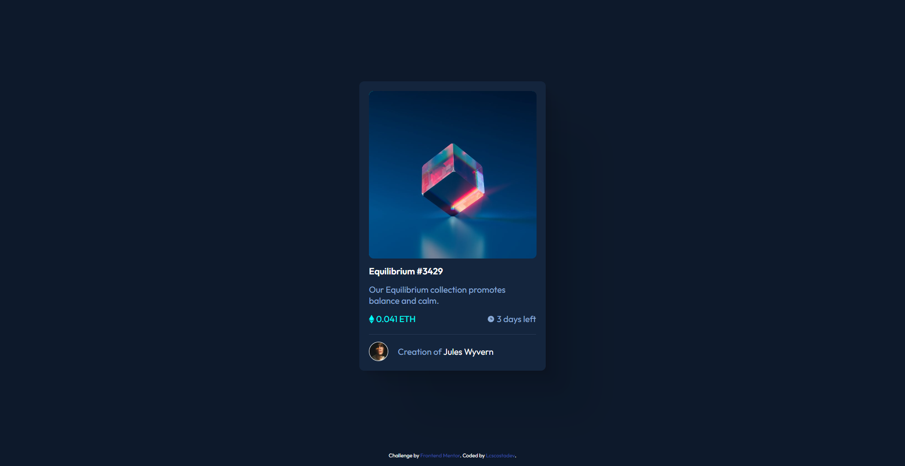

# Frontend Mentor - NFT preview card component solution

This is a solution to the [NFT preview card component challenge on Frontend Mentor](https://www.frontendmentor.io/challenges/nft-preview-card-component-SbdUL_w0U). Frontend Mentor challenges help you improve your coding skills by building realistic projects. 

## Table of contents

- [Overview](#overview)
  - [The challenge](#the-challenge)
  - [Screenshot](#screenshot)
  - [Links](#links)
- [My process](#my-process)
  - [Built with](#built-with)
  - [What I learned](#what-i-learned)
  - [Continued development](#continued-development)
  - [Useful resources](#useful-resources)
- [Author](#author)

## Overview

### The challenge

Users should be able to:

- View the optimal layout depending on their device's screen size
- See hover states for interactive elements

### Screenshot

### Links

- Solution URL: [Add solution URL here](https://www.frontendmentor.io/solutions/nft-preview-card-component-A5ArHr74-M)
- Live Site URL: [Add live site URL here](https://lcscostadev.github.io/frontendmentor-challenges/Newbie/NFT%20preview%20card%20component)

## My process

### Built with

- Semantic HTML5 markup
- CSS custom properties
- Flexbox
- Mobile-first workflow
- Hover
- Root

### What I learned

Hovering, overlaying an image inside another image and box-shadow

### Continued development

Certainly this overlapping of images with transitions and hovers and the use of position

### Useful resources

- [BoxShadow](https://shadows.brumm.af) - This helped me to have a broader view of how my drop shadow would look

## Author

- Website - [Lucas Costa](https://lcscostadev.github.io/lucas-costa-portfolio/)
- Frontend Mentor - [@lcscostadev](https://www.frontendmentor.io/profile/lcscostadev)
- Twitter - [@lcscostadev](https://www.twitter.com/lcscostadev)
