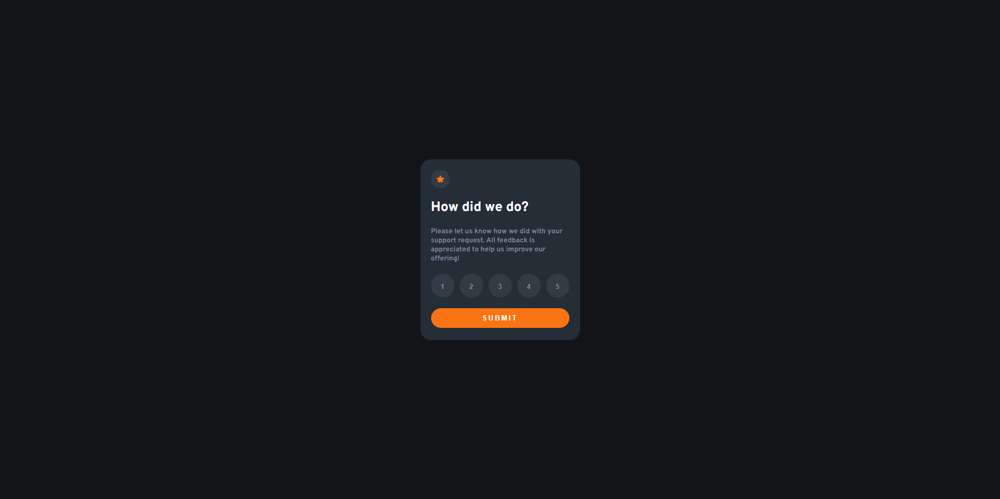

# Frontend Mentor - Interactive rating component solution

This is a solution to the [Interactive rating component challenge on Frontend Mentor](https://www.frontendmentor.io/challenges/interactive-rating-component-koxpeBUmI). Frontend Mentor challenges help you improve your coding skills by building realistic projects. 

## Table of contents

  - [The challenge](#the-challenge)
  - [Screenshot](#screenshot)
  - [Links](#links)
- [My process](#my-process)
  - [Built with](#built-with)
  - [What I learned](#what-i-learned)
  - [Continued development](#continued-development)
  - [Useful resources](#useful-resources)
- [Author](#author)
- [Acknowledgments](#acknowledgments)

### The challenge

Users should be able to:

- View the optimal layout for the app depending on their device's screen size
- See hover states for all interactive elements on the page
- Select and submit a number rating
- See the "Thank you" card state after submitting a rating

### Screenshot

### Links

- Solution URL: [Add solution URL here](https://github.com/lcscostadev/frontendmentor-challenges/tree/main/Newbie/Interactive%20rating%20component/interactive%20rating)
- Live Site URL: [Add live site URL here](https://lcscostadev.github.io/frontendmentor-challenges/Newbie/interactive-rating/)

## My process
I've started with the css first to make closest possible to the original screenshot's then re built some things like changing the section to a form and make the buttons dinamically, then just finished using the ternary operator to make the swap for the thank page.

### Built with

- Semantic HTML5 markup
- CSS custom properties
- Flexbox
- Mobile-first workflow
- [React](https://reactjs.org/) - JS library

### What I learned

I never did an interactive rating so I think what I learned the most was this, I thought it would be much more complex than it seems

### Continued development

Maybe in the future i'll make a hover slide transition when the user hovers through the star at the top, like a tip for him to select a rate.

## Author

- Website - [lcscostadev](https://lcscostadev.github.io/lucas-costa-portfolio/)
- Frontend Mentor - [@lcscostadev](hhttps://www.frontendmentor.io/profile/lcscostadev)
- Twitter - [@lcscostadev](https://www.twitter.com/lcscostadev)
